<!-- Galaxy Profile README Template
     Customize this file with your own info, then rename it to README.md
     in your GitHub profile repo (github.com/YOUR_USERNAME/YOUR_USERNAME).
     The SVG paths below point to assets/generated/ which are auto-generated
     by the GitHub Actions workflow or by running: python -m generator.main -->

  

 

 

  

 

  

 
Building full-stack applications with React, Vite, and Node.js. Passionate about CI/CD automation and developer tooling. Self-taught developer currently leveling up in system design.

 

**🚀 Current mission**: Authentication User Dashboard: a secure auth system with email verification, CAPTCHA, and Google Maps integration

**🧠 Currently learning**: Python • TypeScript • C++ • System Design • Playwright

**💬 Ask me about**: React • Node.js • CI/CD • why automation matters

**🎓 Background**: German schooling in Thessaloniki, moving to Austria for university

**🔍 Open to Opportunities**: I'm actively seeking a **Werkstudent role in Linz, Austria** starting in 2026. I'm particularly interested in:
- Full-stack development with React/Node.js
- Developer tooling and CI/CD automation
- Opportunities to learn from experienced teams while contributing fresh ideas

 

 

  
  
  

 

